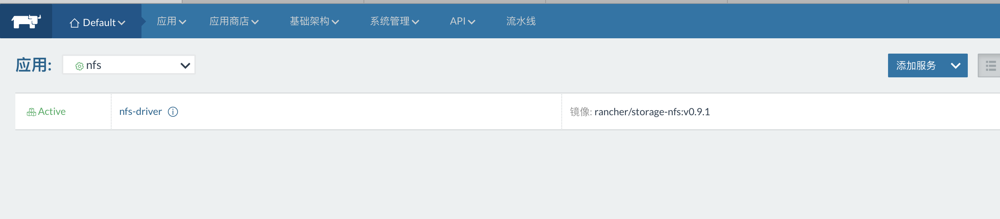
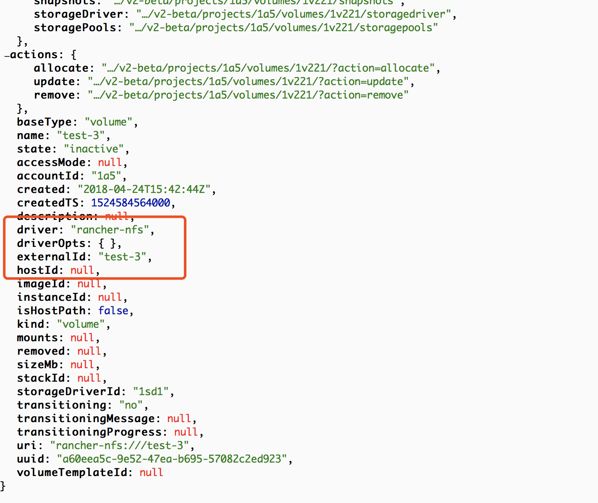

NFS卷驱动插件是什么就不再叙述，直接上步骤。

## 一、NFS服务端配置

```
实验环境：Ubuntu16.04 、Rancherv1.6.17 、 rancher/storage-nfs:v0.5.0
```

1. NFS服务器安装

   apt-get install nfs-kernel-server -y


2. 在/etc/exports最后一行添加NFS共享路径，例如：

   ``` /home/nfs  *(rw,sync,no_root_squash,no_subtree_check)```

   > 参数说明：
   >
   > /home/nfs： nfs共享的目录;
   >
   >  *:                    表示所有IP。如果填写为192.168.1.100表示一个主机能访问，
   >
   > ​                        如果填写为192.168.1.0表示一个网段能访问;
   >
   > rw：                read-write，可读写；
   >
   > ro：                read-only，只读；
   >
   > sync：            同步写入（文件同时写入硬盘和内存），适用在通信比较频繁且实时性比较高的场景；
   >
   > async：		异步写入（文件先写入内存，稍候再写入硬盘），性能较好（速度快），适合超大或者超			
   >
   > ​			多文件的写入，但有数据丢失的风险，比如突然断电等情况；
   >
   > root_squash(默认)：   将来访的root用户映射为匿名用户或用户组；
   >
   > no_root_squash：            来访的root用户保持root帐号权限（可能会不安全）；
   > no_all_squash(默认)：访问用户先与本机用户匹配，匹配失败后再映射为匿名用户或用户组；
   > all_squash：                      将来访的所有用户映射为匿名用户或用户组；
   > secure(默认)：              限制客户端只能从小于1024的tcp/ip端口连接服务器；
   > insecure：                          允许客户端从大于1024的tcp/ip端口连接服务器；
   > anonuid：                           匿名用户的UID值，通常是nobody或nfsnobody，可以在此处自行设定；
   > anongid：                           匿名用户的GID值；
   > no_subtree_check：          如果NFS输出的是一个子目录，则无需检查其父目录的权限(可以提高效率);

3. 配置NFS服务端开机启动，并重启host:   

   ```systemctl enable nfs-blkmap.target && reboot```

4. 本机测试NFS服务器连通性：

   ```mount -t nfs 远程IP:/远程路径  /local路径```

## 二、NFS驱动卷安装配置

1. 在应用商店（catalog）中搜索NFS，接着点击VIEW Details 进入配置详情页。

2. 配置参数

   

> 参数说明：
>
> NFS  Server ：          NFS服务器的IP地址，端口默认2049；
>
> Mount Dirctory:       NFS配置的共享存储路径；
>
> MoutOptions:          默认可以不用填，如果server端口有变动，可以在这里通过 port=2049 来指定新端口；
>
> NFS Version:            默认4版本；
>
> On Remove:            当移除Rancher NFS卷的时候，底层数据是否应该被保留或者清理。选项有`purge`和`retain`，默认值为`purge`。从Rancher 1.6.6开始支持。

3. 最后点击launch，接着会自动跳转到应用栈（stack）页面。

   参考链接：http://rancher.com/setting-shared-volumes-convoy-nfs/



## 三、配置应用自动创建容器卷

1. 创建空应用栈并添加服务

   

> 注意：
>
> **卷**：卷书写格式为 :卷名(volumename):容器内路径；
>
> **卷驱动**：填写卷驱动名：rancher-nfs，如果不填，会使用默认local驱动；

2. 服务创建完成

   

3. UI查看卷状态

   

   

   ​

   PS:因为填写的是rancher-nfs驱动，所以会自动进行归类。

4. 卷状态说明

   卷有七个不同的状态：`inactive`，`activating`，`active`，`deactivating`，`detached`，`removing`和`removed`；

   通过UI创建服务，容器被创建前，卷被自动创建并在创建容器时挂载到容器；

   一个新创建的卷处于`inactive`状态，直到一个容器试图连接它为止；

   创建容器时，关联的卷将进入`activating`状态。一旦容器进入`running`阶段，其容量就会进入`active`状态。容器挂载处于`active`状态的卷不会影响该卷的状态；

   当连接到卷的所有容器都标记为删除时，卷将进入`deactivating`状态；一旦容器被全部删除，卷就进入`detached`状态；

   当一个卷被标记为删除时，它会进入一个`removing`状态。一旦数据从主机中删除，它就进入`removed`状态。列出卷时，删除的卷不会显示，但它们在Rancher API中持续存在一段时间，以便进行调试和审计。

5. 卷API查看

   通过API可以更具体的查看卷参数详情，比如卷driver、accessMode、容器挂载点path等；

   

   ​

## 四、UI手动创建卷

1. 在存储界面点击 添加卷；

   

   

2. 添加卷名，点击创建；

   

3. 查看卷状态

4. 创建服务挂载卷

5. 从上面的步骤可以发现，挂载手动创建的卷，不需要填写卷驱动名。因为在指定的驱动分类下创建的卷，已经默认了卷驱动，比如我们创建test-3，通过API查看它的驱动信息：

   

   

   ​

   ## 五、驱动卷的高级用法

   虽然在安装rancher-nfs驱动时，指定了**NFS服务器**、**共享目录**以及其他参数，但实际使用中往往对这些参数需要调整，通过驱动卷的高级用法就可以实现灵活修改这些参数。目前无法通过UI创建服务的形式来自动修改这些值，目前有两种方法：

   比如自定义NFS地址和共享目录：

   1. 通过compose文件部署应用，在compose文件中定义这些值；

      ```yaml
      version: '2'
      services:
        demo1:
          image: alpine
          stdin_open: true
          volumes:
          - demo1:/root
      volumes:
        demo1:
          driver: rancher-nfs
          driver_opts:
            host: 192.168.62.130
            exportBase: /home/nfs
      ```

   2. 在UI界面手动创建卷的形式；

      


