## 概要

阿里云SLB介绍就不再详细叙述，这里简要说明几个问题：

1、阿里云SLB只是负载均衡器，没有反向代理功能。，无法实现类似nginx 或者haproxy反向代理后端功能；

2、SLB所在区域必须与ECS服务器所在区域相同。

Rancher的安装也不再叙述，具体安装方法请关注Rancher公众账号或者浏览Rancher中国官方博客。以下文章基于一套已经搭建好的Rancher系统。

## Aliyun-slb**服务安装**

### 添加Aliyun-slb应用商店

通过Rancher_server-ip:8080登录WEB后，在系统管理|系统设置中添加一个自定义商店。

名称：SLB

地址：<https://github.com/niusmallnan/slb-catalog.git>

版本：master

保存后，在应用商店|全部 中搜索slb可以看到相应的应用。

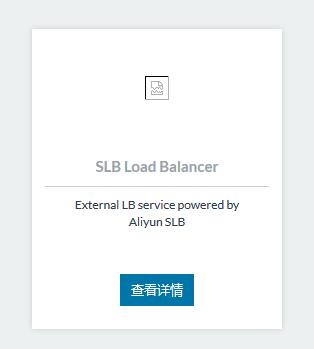

### Aliyun-slb安装

点击详情后进入配置界面：

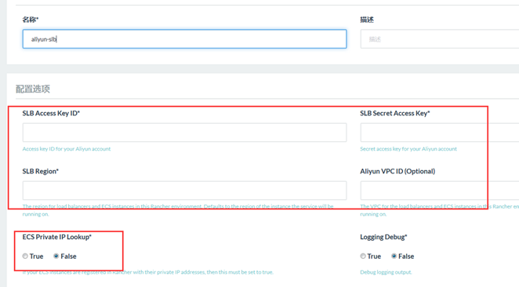

名称：保持默认；

描述：可选；

配置选择

SLB Access Key ID:
AccessKey管理器中查看；

SLB Secret Access Key：AccessKey管理器中查看；

SLB Region：SLB所在区域。进入SLB首页后，选中你SLB服务所在的区域，查看浏览器的地址。比如，如果是华南区，查看浏览器地址，那么cn-shenzhen就是它的区域；

Aliyun VPC ID：VPC ID，进入VPC网络首页，找到你ECS绑定的VPC网络并点击进去，页面的中间有一个ID；

ECS Private IP Lookup ：这个地方需要选择true，原因后面讲解；

最后点击启动，等待应用启动完成。

## Aliyun SLB配置

登录阿里云控制台，进入负载均衡首页。右上角点击创建负载均衡，根据需要创建好负载均衡后，如图：

点击负载均衡名称进入负载均衡配置界面，点击左侧监听，接着点击右上角添加监听。

如下图，因为接下来要启动一个nginx服务来演示，所以这里前端通过http协议监听8888端口，后端（ECS服务器）容器映射到8888端口上；

宽带和调度算法保持默认；

虚拟服务器组：把多个运行相同服务的主机捆绑在一起，这个适用于手动配置SLB，Aliyun SLB动态配置不需要勾选；

高级配置保持默认；

监控检测中端口设置8888，其他默认；

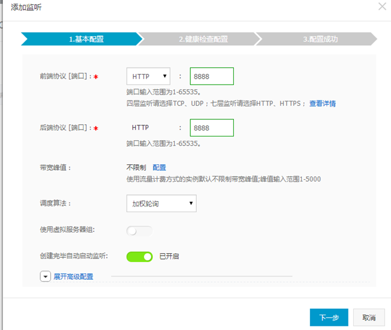

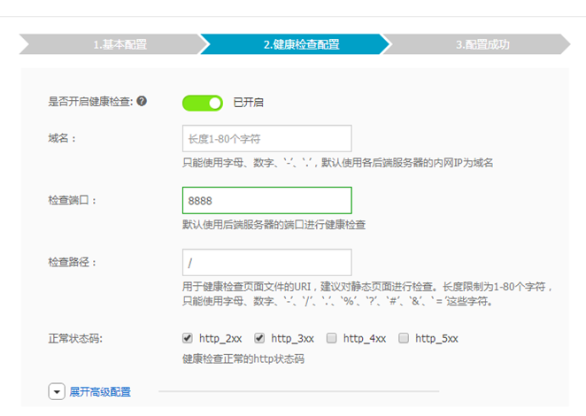

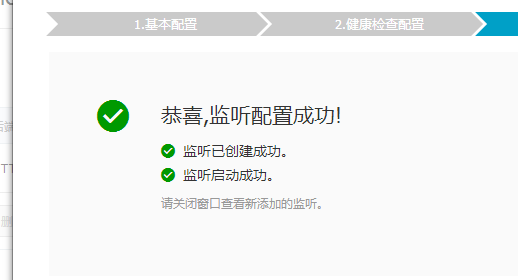

其他的保持默认，返回负载均衡列表。

配置好的负载均衡如下图：

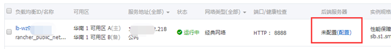

因为Aliyun SLB应用动态注册可用的服务信息到负载均衡**实例**上，后端服务器这里就不需要设置。

**现在，我们回到前面讲到的ECS Private IP Lookup 开关，如果设置没有打开，ECS服务器的IP地址无法传递给负载均衡实例，最后会导致负载均衡实例无法动态获取到后端服务器。**

## 示例服务配置

接下来创建一个nginx应用栈并创建一个nginx服务。创建服务的时候有几个地方要设置：

1、端口映射

服务映射到宿主机的端口必须与负载均衡里面配置的端口相同；

2、服务容器标签

创建容器的时候需要指定一个标签:io.rancher.service.external_lb.endpoint=xxxx, **后面的XXXX为创建的负载均衡实例ID，这个ID在负载均衡首页可以看到。**

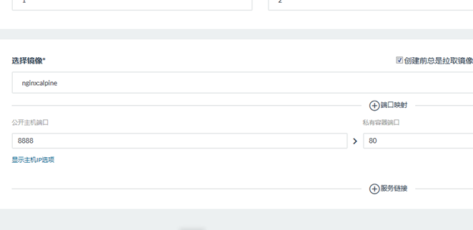

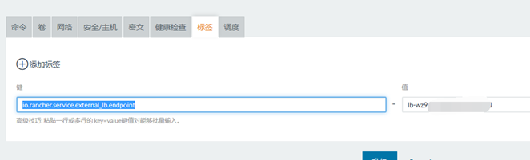

nginx服务跑起来之后，我们看Aliyun SLB服务的日志：

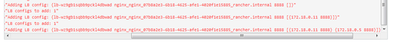

我起了两个nginx实例分别运行在两台主机上。

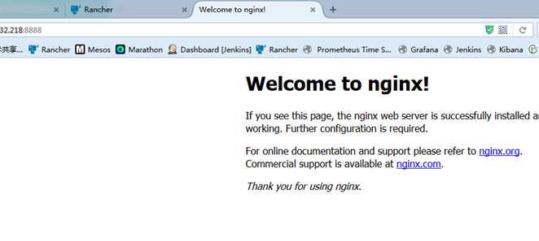

现在可以正常访问了。进入负载均衡首页查看，已经获取到后端服务器了。

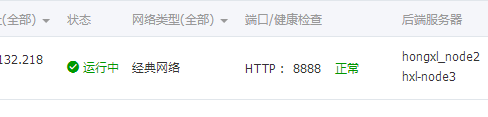

## 负载均衡测试

首先修改nginx默认页面的内容并刷新，因为默认为轮询，所以每刷新一次页面就会变化：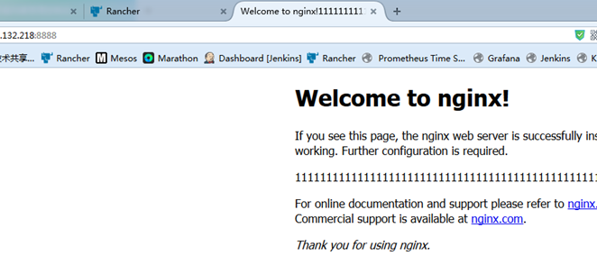

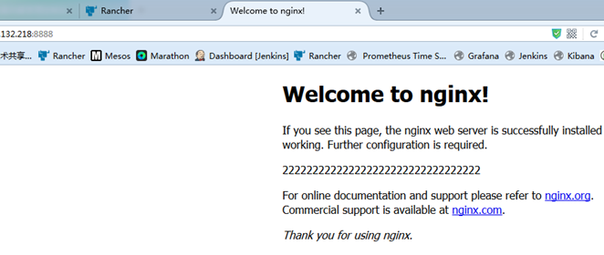

## 原理

Aliyun-slb通过API与阿里云平台对接， Rancher中启动服务时添加一个标签来表示这个服务需要使用阿里云负载均衡，启动的应用需要映射宿主机端口。 Aliyun-slb会根据创建的应用映射的宿主机端口去检测阿里云负载均衡有没有监听相应的端口。如果端口检测通过，那么Aliyun-slb会把服务的相关参数传递给负载均衡，否则会提示刷新配置失败，负载均衡没有监听某某端口。