## 引言

文档参考<http://www.cnrancher.com/rancher-logging/> 。

一个完整的容器平台，容器日志收集也是很重要的一环。尤其在微服务架构大行其道状况下，程序的访问监控、健康状态检查很多都依赖日志信息的收集，由于Docker的存在，让容器平台中的日志收集和传统方式很多不一样，日志的输出和收集与以前也大有不同。本文就此探讨一下，Rancher平台内如何做容器日志收集。

## 现状

纵览当前容器日志收集的各种解决方案，无非就是两种方式：一、直接采集Docker标准输出，通过Docker的日志驱动（log driver）可以发送到相应的收集程序中；二、非标准输出，延续传统的日志写入方式，容器内的服务将日志直接写到Log文件中，通过Docker volume映射形式，将日志文件映射到Host上，日志采集程序直接收集映射出来的Log文件。三、通Journald 收集二进制日志数据。

PS：

标准输出：即通过docker logs查看到的日志信息。Ubuntu OS下，这些信息默认保存在/var/lib/docker/containers路径下以容器ID为名的文件夹下并以容器ID为前缀的 -json.log 文件中。

非标准输出：根据Docker容器的特性，容器启动后必须有一个服务保持前台运行。如果一个容器要运行多个服务，那么按照启动顺序，前面的服务就必须得后台运行。 所以，默认情况下这些后台运行的服务产生的日志将无法以标准输出获取，产生的日志默认会存放于/var/log 目录下。

第一种方式足够简单，直接配置相关的日志驱动（Log driver）就可以，但是这种方式也有些劣势：

1. 当主机的容器密度比较高的时候，对Docker Engine的压力比较大，毕竟容器标准输出都要通过Docker Engine来处理。
2. 尽管原则上，我们希望遵循一容器部署一个服务的原则，但是有时候特殊情况不可避免容器内有多个业务服务，这时候很难做到所有服务都标准输出日志，这就需要用到传统的方式收集log日志。
3. 虽然我们可以选择很多种Log Driver，但是有些Log Driver会破坏Docker原生的体验，比如，日志输出到其他日志服务器后，docker logs将无法看到容器日志。

基于以上考虑，一个完整的日志收集方案必须要同时满足标准输出收集和日志卷（非标准输出）收集或者通过journald 收集二进制日志数据
。当然完整的日志体系中，并不仅仅是采集，还需要有日志存储和UI展现。日志存储有很多种开源的实现，这个一般用户都会有自己钟情的选择。而UI展现更是各家有各家的需求，很难形成比较好的标准，一般都是通过定制化方式解决。所以此文主要展现的方案是日志采集方案，当然在存储和UI展现上会对接开源实现，没有特殊需求的情况下，也可以拥有一个完整的体验。

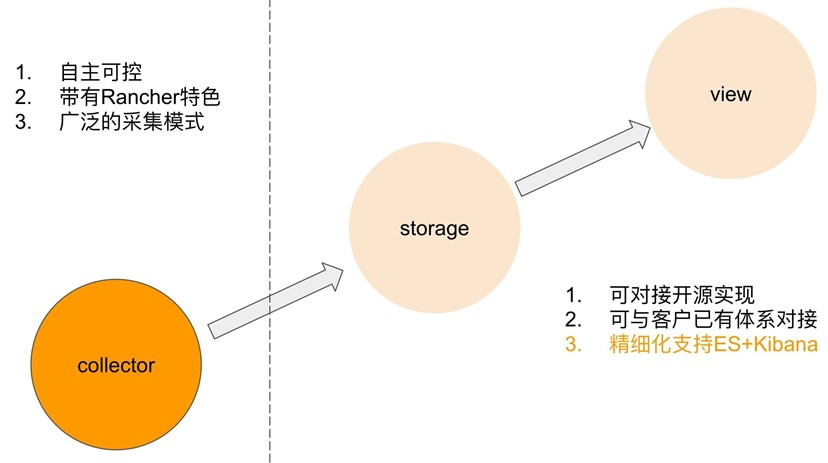

Rancher下的解决方案（json-file驱动）

## 方案介绍

如上面图中所示，日志存储和UI展现可以直接使用ElasticSearch & Kibana。日志采集方面如之前所分析，需要对接两种采集模式（标准输出日志和非标准输出），本方案中，日志采集这部分采用Fluentd & Logging Helper的组合。Fluentd是很通用的日志采集程序，拥有优异的性能，相对Logstash来说同等压力下，其内存消耗要少很多。

为了要保证Dokcer和Rancher体验的完整性，之所以Docker Log Driver选择Json-file或者Journald，其原因：一、json-file和journald相对来说比较常用；二、这两种驱动下，docker logs依然可以有内容输出，保证了体验的完整性。

## 实现流程

方案实现流程：Fluentd对接Json-file或者Journald驱动，获取标准输出日志数据或者二进制日志数据； Logging Helper可以理解为Fluentd的助手，它可以识别容器日志卷（非标准输出）映射的路径，并通知Fluentd进行采集。 Fluentd收集数据后，接着数据被传递并存储到ES，最后Kibana将ES中的数据直接展示出来。

下面开始说明，整个方案的部署过程。先用一张图来描述整体的部署结构，如下：

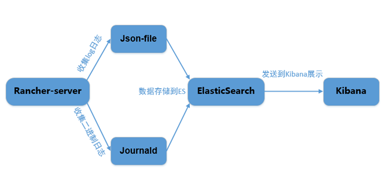

## 方案部署

### ElasticSearch & Kibana部署

通过web登录Rancher，进入应用商店，搜索ElasticSearch，推荐安装2.x版本。

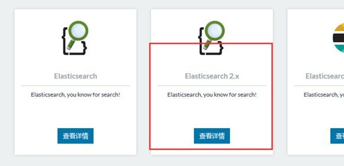

点击查看详情， 进去后修改一下最后的Public port，默认为80端口， 改为其他端口避免端口冲突。

接着再进入应用商店搜索Kibana.

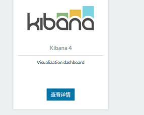

配置选项中，需选择Elasticsearch-clients

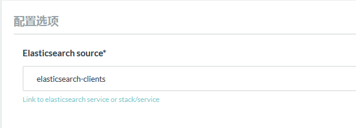

最后的Public port 根据实际情况进行修改，避免冲突。

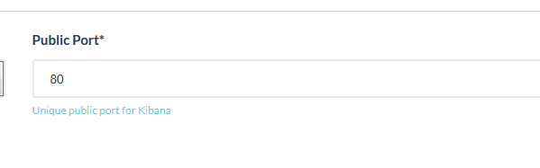

服务正常启动后，可以通过这个端口访问Kibana web 页面。

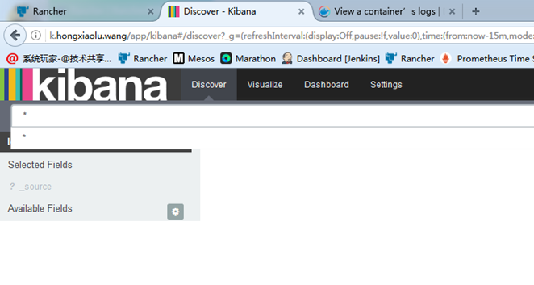

### Rancher logging服务部署

目前Rancher logging不在官方仓库中，所以需要使用Rancher logging 需要添加自定义商店地址。 点击小图管理|系统设置 进入， 点击添加应用商店，

名称：rancher -logging

地址： <https://github.com/niusmallnan/rancher-logging-catalog.git>

分支：master

最后点击保存，并返回应用商店。在应用商店中输入log进行搜索：

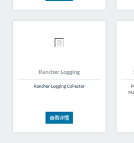

点击查看详情进去，进入配置页面：在本示例中，除了Elasticsearch source 如图配置外，其他保持默认：

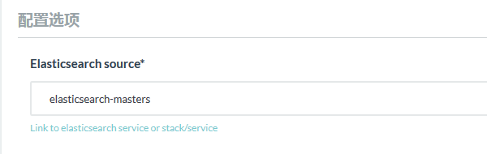

以上部署完成之后，部署一些应用并产生一些访问日志，就可以在Kibana的界面中看到：

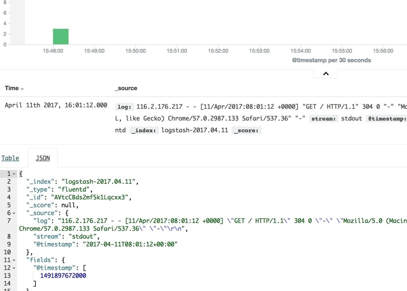

若要使用日志卷方式，则需要在Service启动的时候配置Volume，Volume name需要匹配之前设定的Volume Pattern：

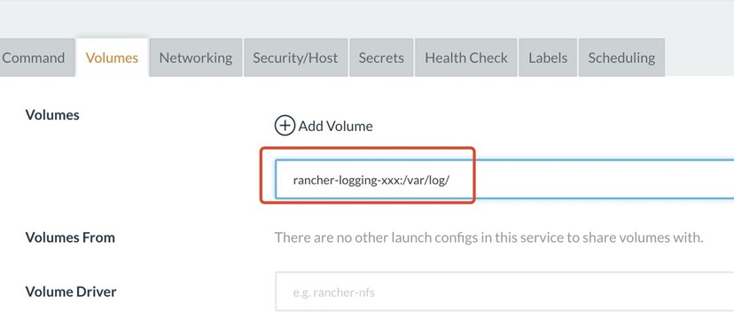