RANCHER SERVER UI 为API操作提供了可视化界面，更加方便参数的配置和调试。

登录RANCHER SERVER后，通过 API\Keys 可以看到API的入口地址；点击 Endpoint (v1) 或者 Endpoint (v2) 对应的链接就可以进入API的详情页面。

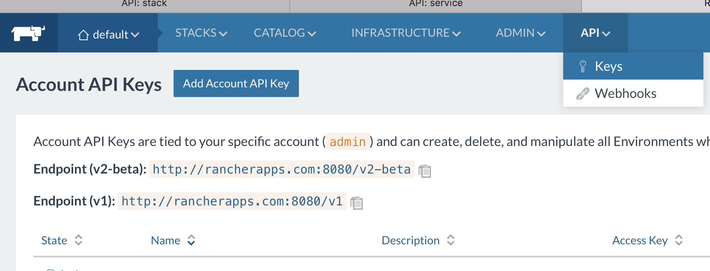
  
这里我们选择Endpoint (v2)作为演示版本

如图所示进入API详情页
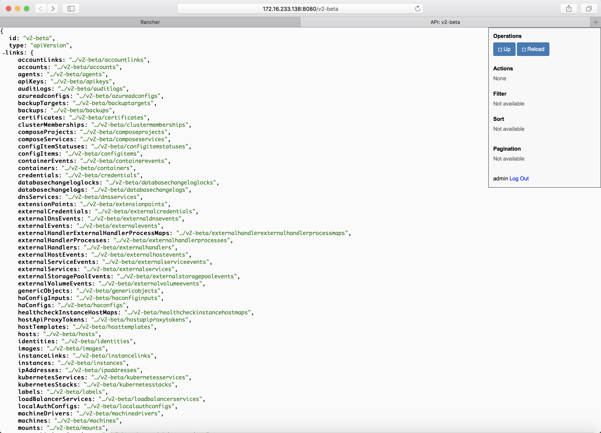

RANCHER API中，主要的功能操作对应的 Fields 如下：

```
1. projecttemplates
Fields: projecttemplates
URL: v2-beta/projecttemplates
```

```
2. Environments
Fields: projects
URL: v2-beta/projects
```
```
3. Stacks
Fields：projects
URL: v2-beta/projects/${projects_id}/stacks
```
```
4. Service
Fields: Services
URL: v2-beta/projects/${projects_id}/stacks/${stacks_id}/services  

```

## API创建环境模板

访问 http://rancher-server-url:8080/v2-beta/projecttemplates，打开projecttemplates详情页

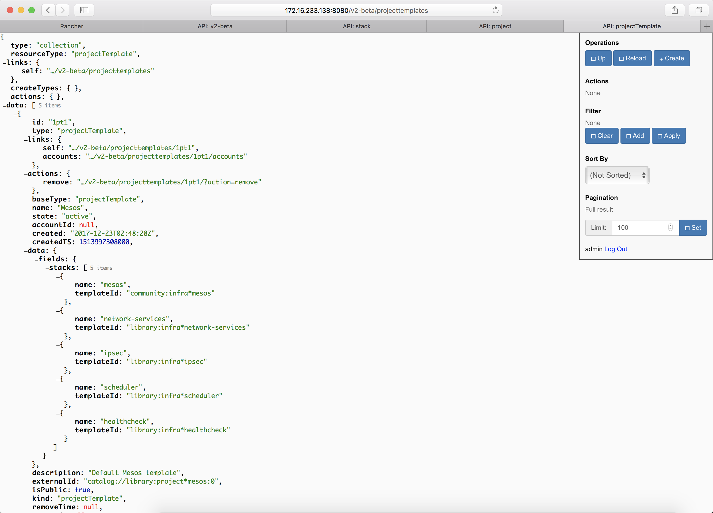

点击右上角的 create, 示例：创建cattle调度环境模板并选择vxlan网络

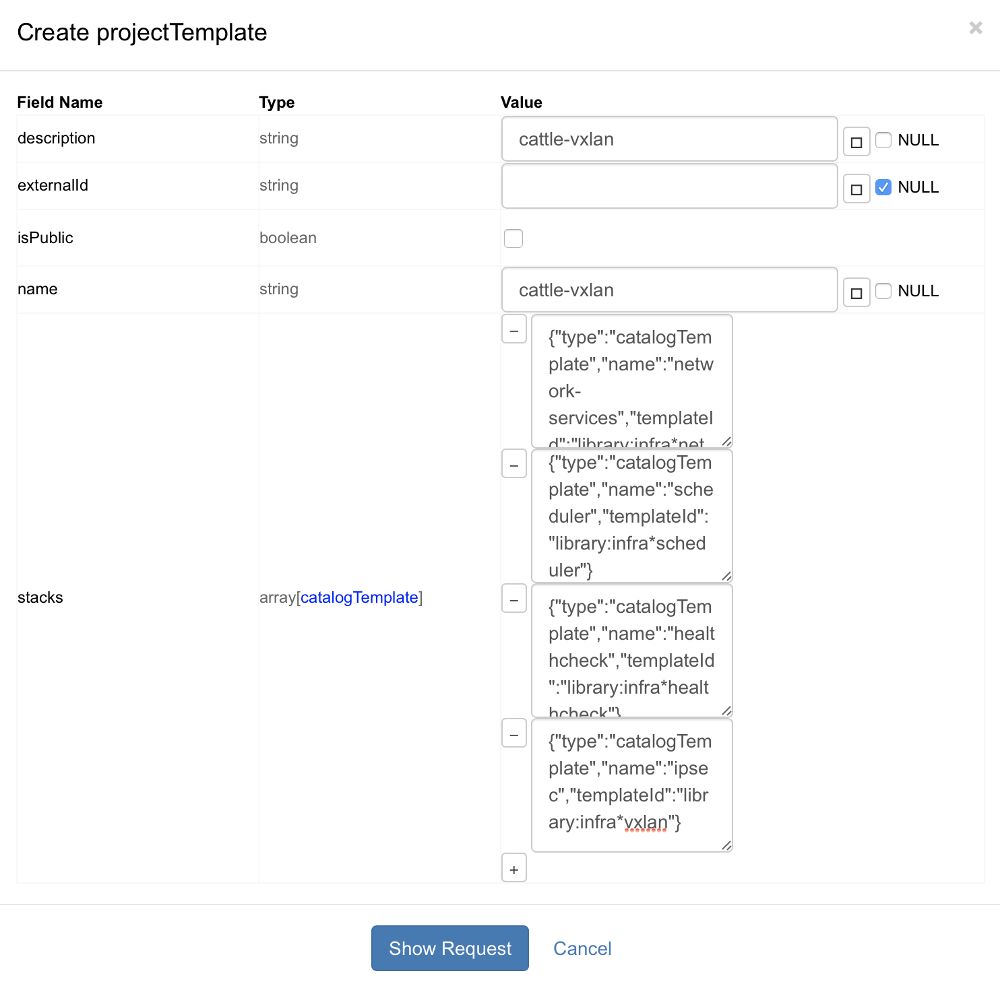
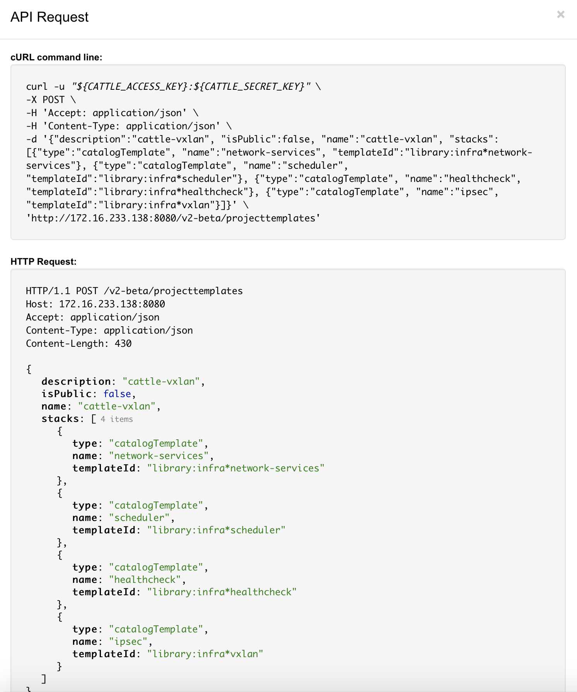
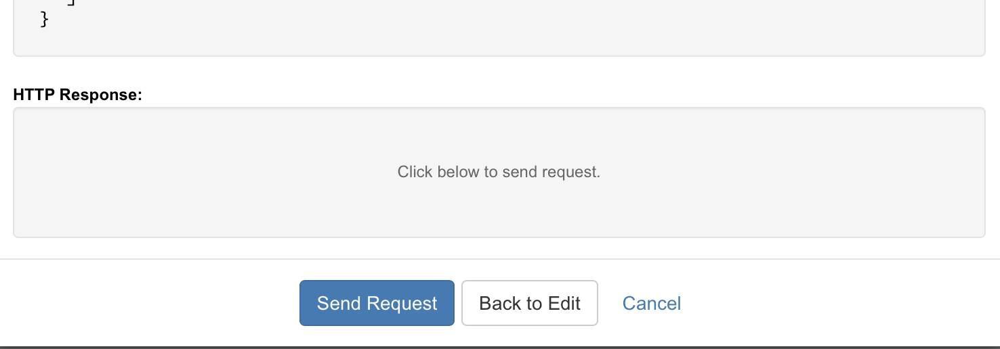

点击 `Send Request ` 后，进入RANCHER UI ,通过环境管理查看新建的环境模板

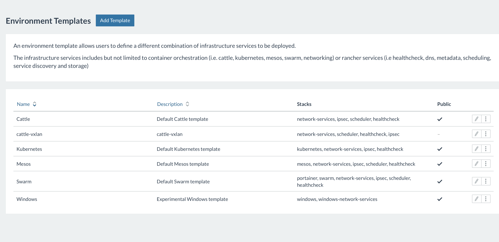
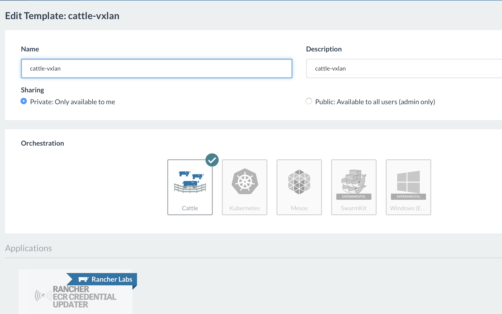
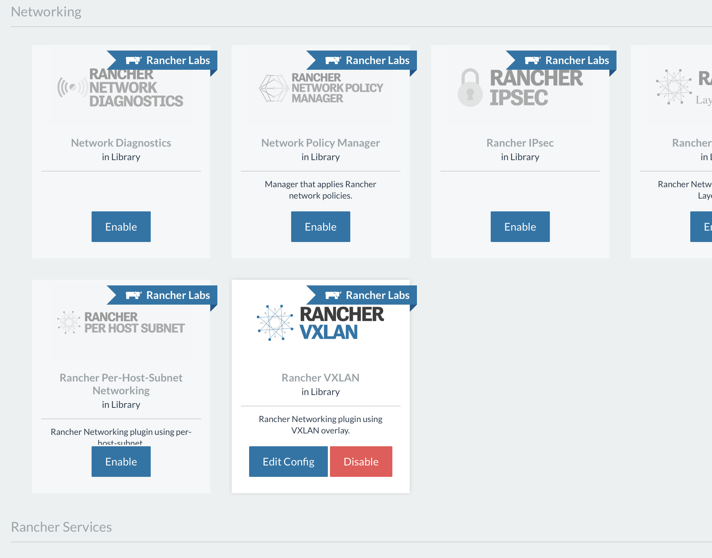

创建环境模板是通过添加的stacks 类型来判断选择哪种调度引擎， RANCHER 默认选择cattle 引擎，所以在上述步骤中没有添加选择调度引擎的stacks。如果要选择其他调度引起，比如kubernetes，在cattle的基础上添加K8S基础应用栈
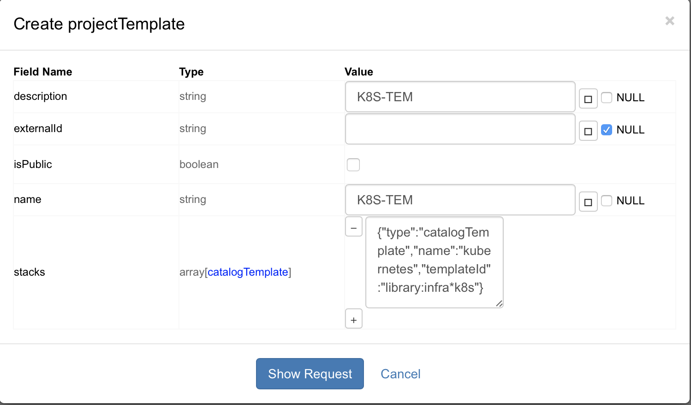

## API创建新环境

访问 http://rancher-server-url:8080/v2-beta/projects，打开projecttemplates详情页

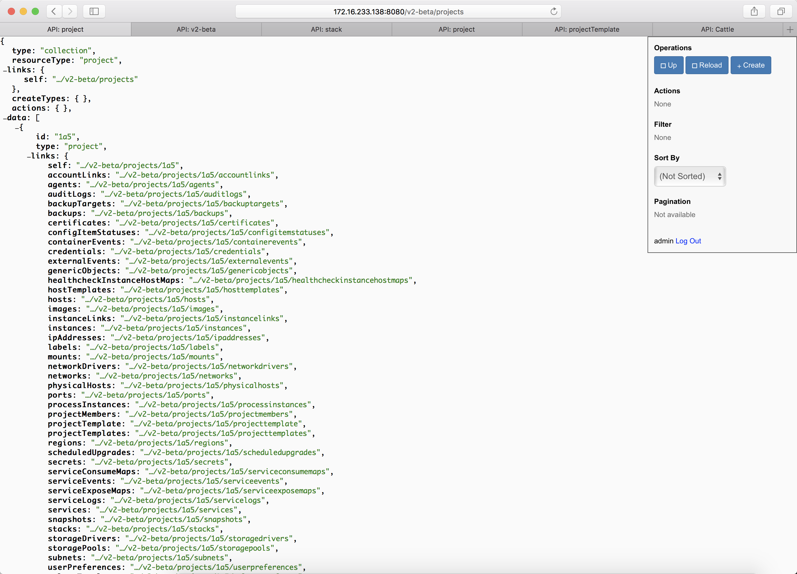

点击右上角的 create

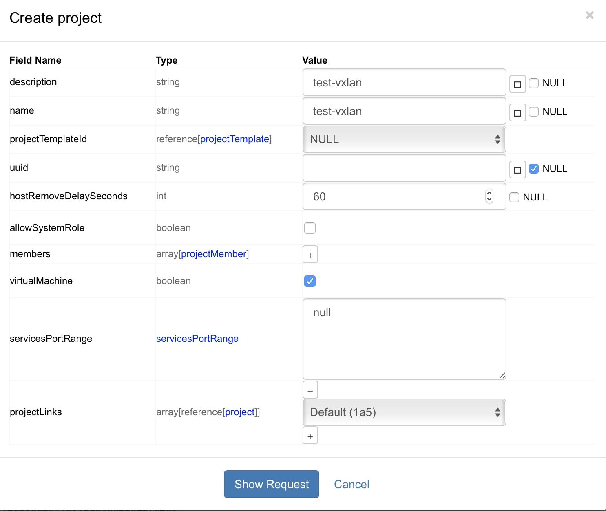

通过环境管理查看新建的环境

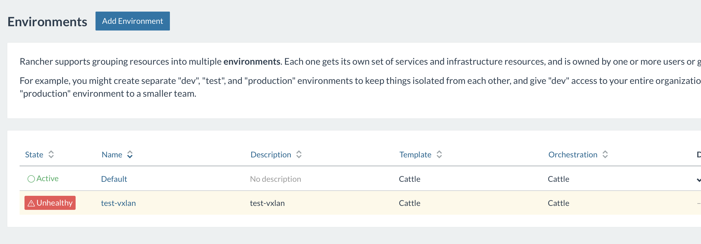

## 为新环境添加主机
通过在RANCHER UI上执行手动添加主机，为新建环境添加主机资源

## 在新环境中创建Stacks

访问 http://rancher-server-url:8080/v2-beta/projects/${projects_id}/stacks

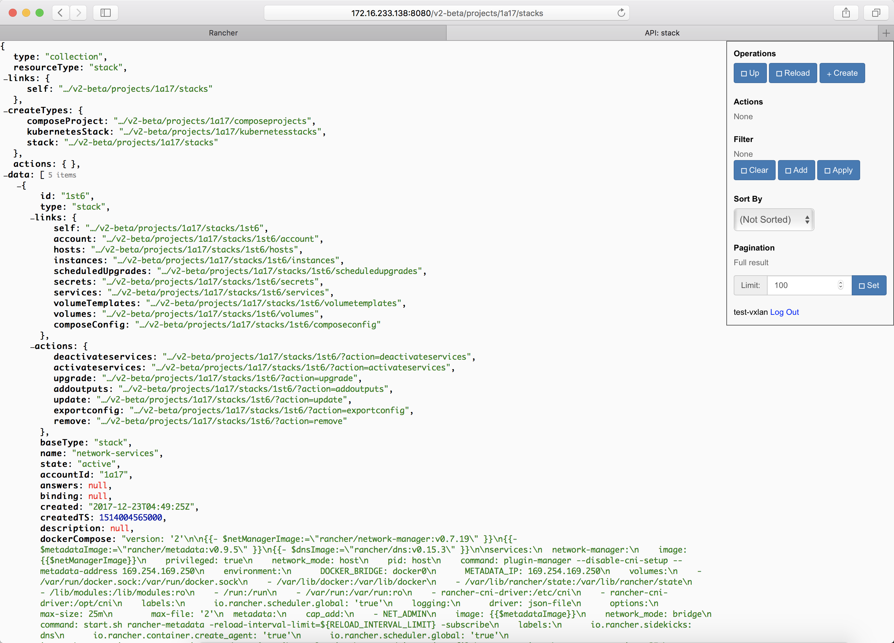

