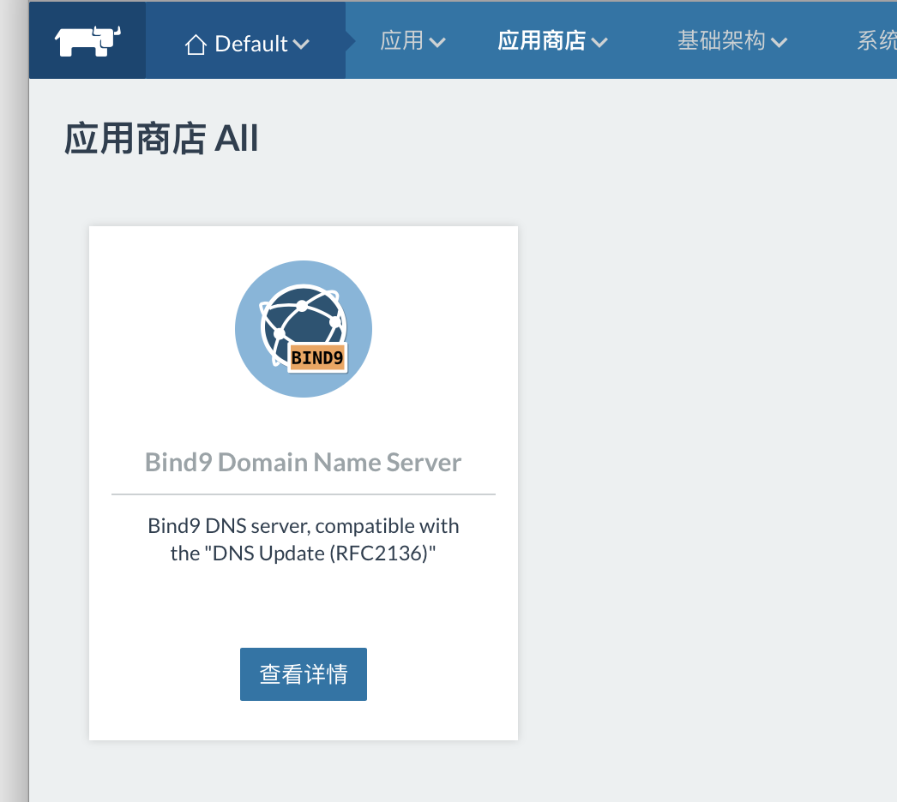
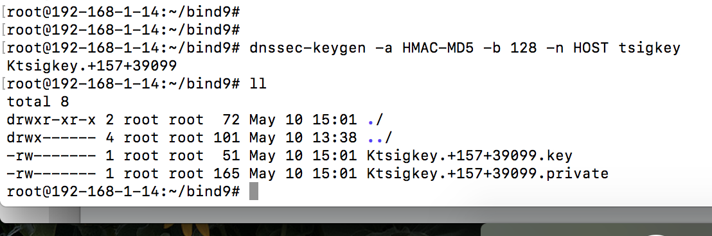
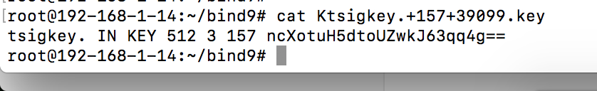
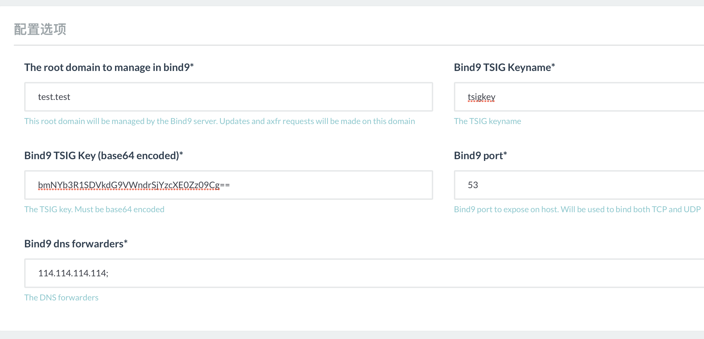
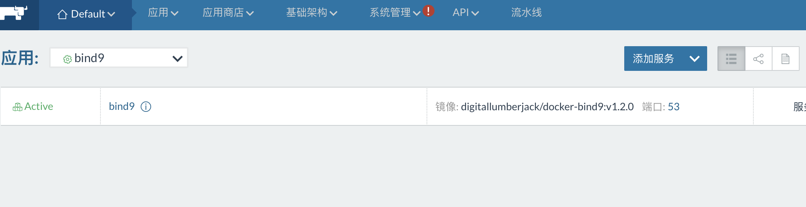
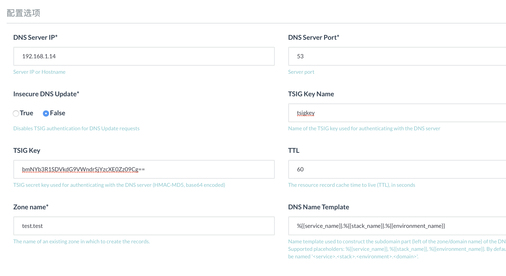

> 本文档基于Rancher1.6.17、traefik1.5.4

##  bind9 安装

一、登录Rancher UI进入应用商店搜索bind9 ，点击详情进入配置界面；



二、bind9配置

1. 生成tsig key

   ```
   dnssec-keygen -a HMAC-MD5 -b 128 -n HOST tsigkey 

   -a:	后面接的[type]为演算方式的意思，主要有RSAMD5,RSA,DSA,DH与HMAC-MD5等。建议你可以使用常见的	HMAC-MD5来演算密码；
   -b:	你的密码长度为多少？通常给予512位的HMAC-MD5；
   -n:	后面接的则是客户端能够更新的类型，主要有底下两种，建议给HOST即可：
   	ZONE：客户端可以更新任何标志及整个ZONE；
   	HOST：客户端仅可以针对他的主机名来更新。
   ```


2. 执行第一步会生成Ktsigkey开头的两个文件

   

3. cat Ktsigkey.+157+39099.key 获取tsig key

   

4. bind9需要使用通过base64加密后的tsig key，接着进行base64加密（也可以在线加密：http://tool.oschina.net/encrypt?type=3）

   ``echo 'ncXotuH5dtoUZwkJ63qq4g=='|base64``

5. 将生成的加密tsig key填入配置选项，点击启动；

   

6. 进入应用栈，点击升级，将bind9服务固定到某一台主机上；

7. 部署完成

   

   ​

## DNS Update (RFC2136)安装

一、进入应用商店搜索DNS Update ，点击详情进入配置界面；

 	1.	填写前面安装的bind9服务地址;
 	2.	是否禁止TSIG authentication for DNS Update，选择false；
 	3.	TSIG  Key Name和TSIG  Key 与安装bind9时填写保持一致；
 	4.	Zone name与安装bind9时填写保持一致；
 	5.	DN Name Template 根据实际需求修改；
 	6.	最后点击启动；



## 测试

