machine-driver 有两种类型，一种是内置在rancher-server镜像里的；另一种是外置的，rancher server运行起来后联网下载的。
## 内置/外置驱动
在主机驱动界面可以看到有内置说明的驱动，没有内置说明的均为外置驱动。
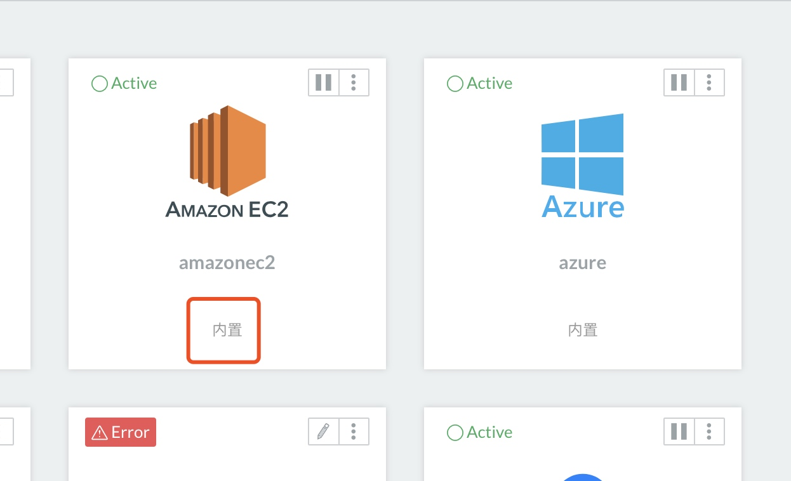
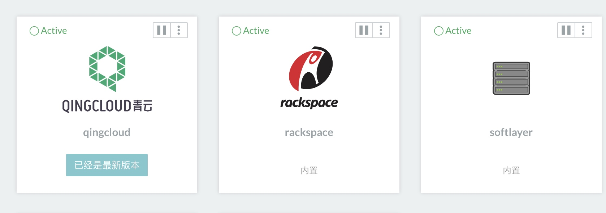

## 激活驱动
如果驱动处于inactive，可以点击右上角激活按钮激活驱动
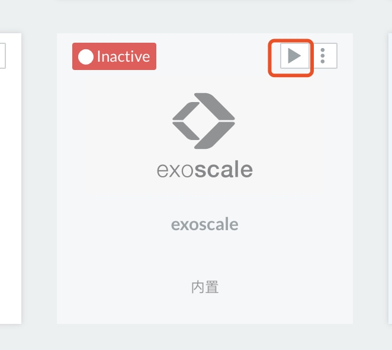

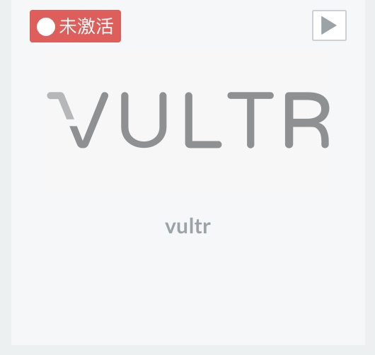

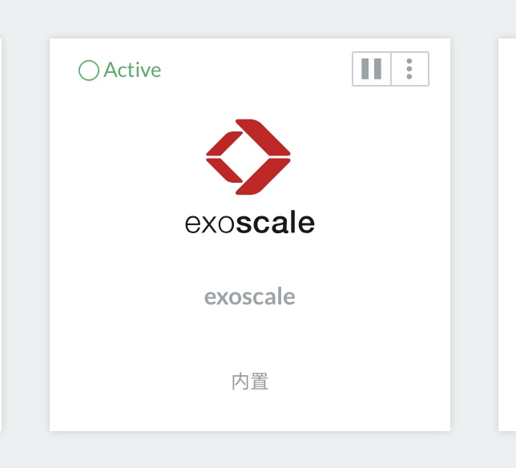

## 修改内置驱动地址
默认情况下，内置驱动默认路径为local://，可以通过API查看
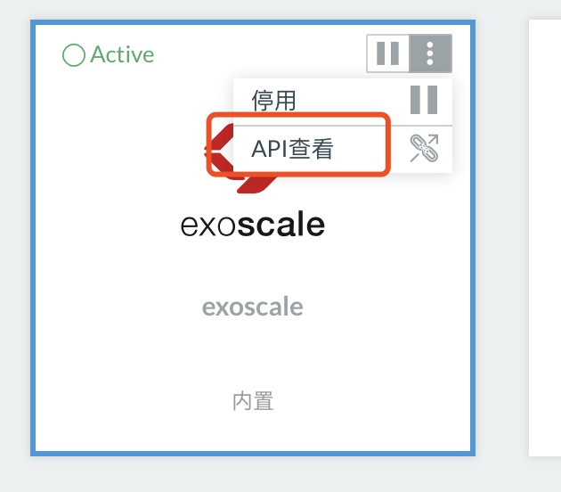

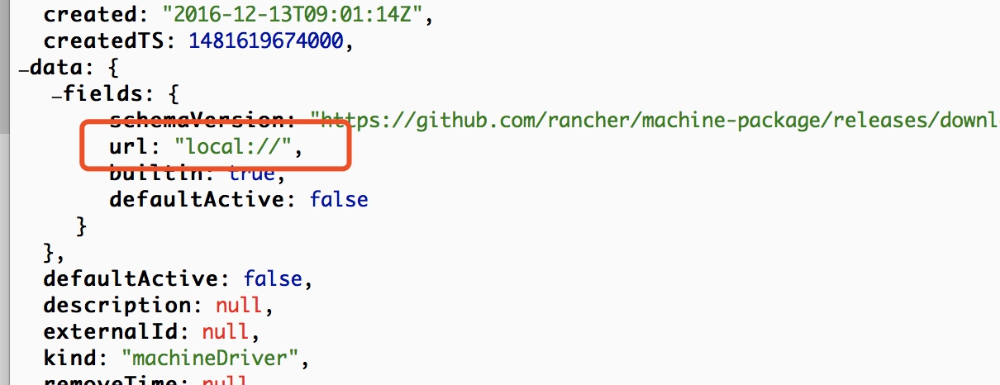
点击右上角编辑 更改默认地址，可以设置为一个http地址
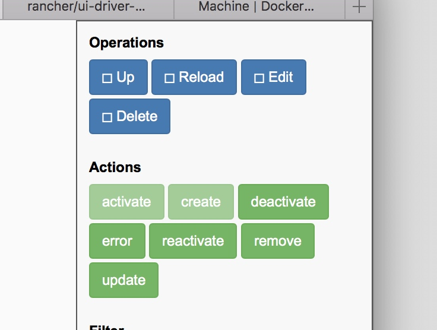

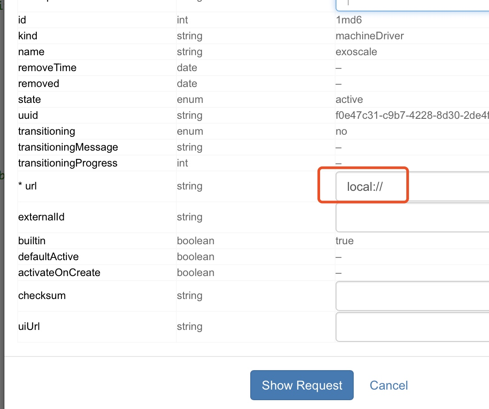

## 修改外置驱动地址
外置驱动为一个URL连接，可以直接更改
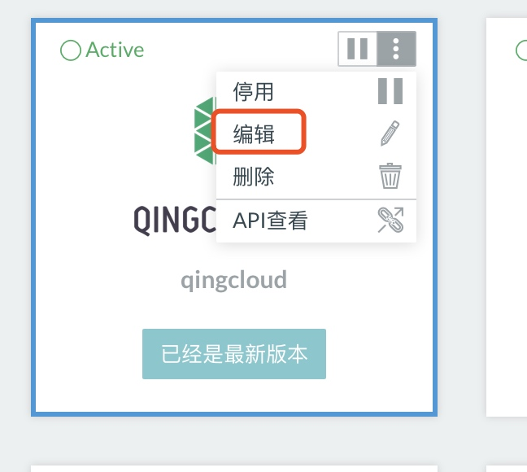

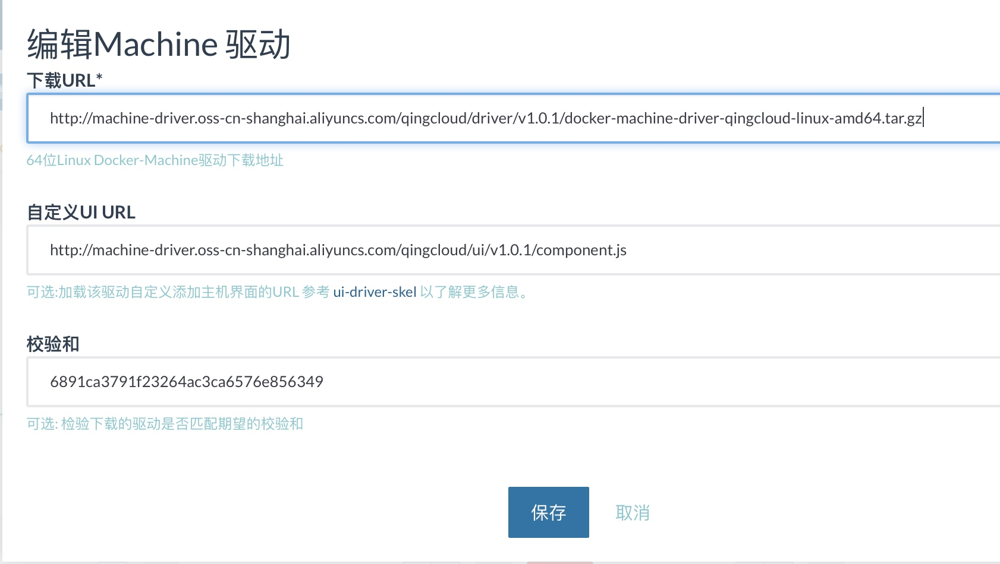

## 添加自定义驱动
如果有自定义驱动，可以通过添加主机驱动添加进rancher server，可以只填下载URL。
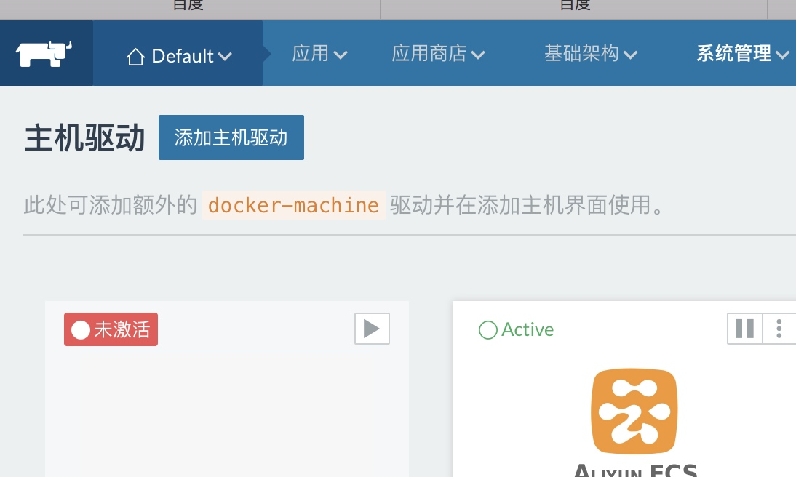
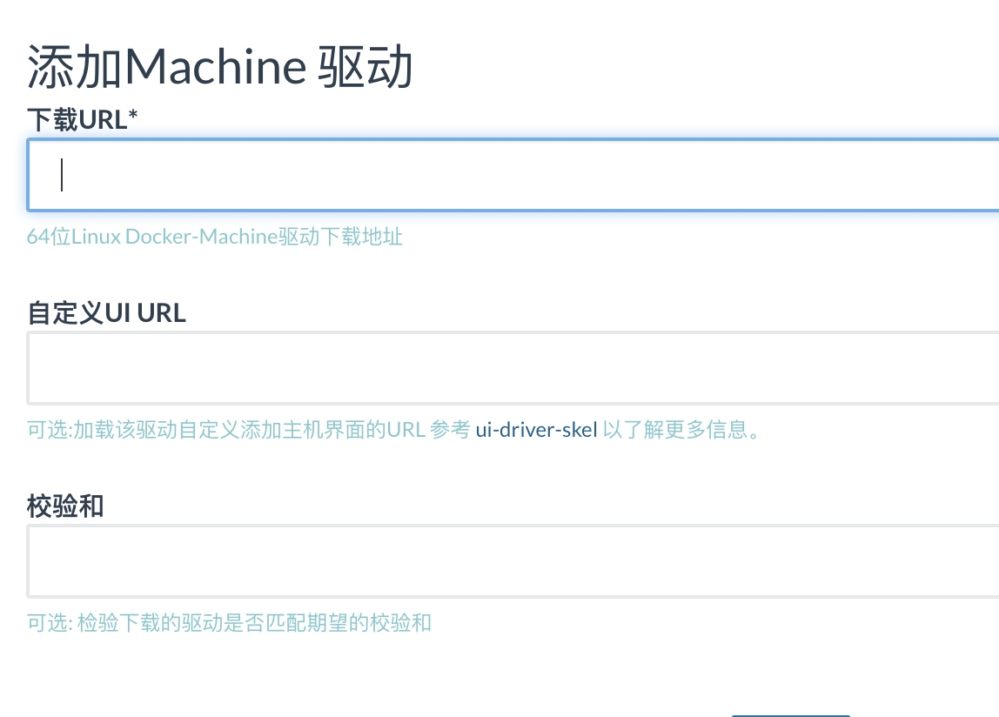

## 驱动列表

外置驱动
aliyunecs：
https://github.com/orangedeng/rancher-machine-driver/raw/master/Aliyun/docker-machine-driver-aliyunecs.tgz

cloudca：
https://objects-east.cloud.ca/v1/5ef827605f884961b94881e928e7a250/docker-machine-driver-cloudca/v1.0.2/docker-machine-driver-cloudca_v1.0.2_linux-amd64.zip

ecl：
https://github.com/mittz/docker-machine-driver-ecl/releases/download/v1.0.0/docker-machine-driver-ecl-v1.0.0-linux-amd64.tar.gz

hetzner：
https://github.com/JonasProgrammer/docker-machine-driver-hetzner/releases/download/0.2.7/docker-machine-driver-hetzner_0.2.7_linux_amd64.tar.gz

interoutevdc：
https://github.com/Interoute/docker-machine-driver-interoutevdc/releases/download/v1.1/docker-machine-driver-interoutevdc_linux-amd64.tar.gz

oneandone：
https://github.com/1and1/docker-machine-driver-oneandone/releases/download/v1.1.1/docker-machine-driver-oneandone-linux-amd64-v1.1.1.tar.gz

opennebula：
https://github.com/OpenNebula/docker-machine-opennebula/releases/download/release-0.2.0/docker-machine-driver-opennebula.tgz

p2pub：
https://github.com/iij/docker-machine-driver-p2pub/releases/download/1.0/docker-machine-driver-p2pub-linux-amd64.zip

packet：
https://github.com/packethost/docker-machine-driver-packet/releases/download/v0.1.2/docker-machine-driver-packet_linux-amd64.zip

profitbricks：
https://github.com/profitbricks/docker-machine-driver-profitbricks/releases/download/v1.3.3/docker-machine-driver-profitbricks-v1.3.3-linux-amd64.tar.gz

qingcloud：
http://machine-driver.oss-cn-shanghai.aliyuncs.com/qingcloud/driver/v1.0.1/docker-machine-driver-qingcloud-linux-amd64.tar.gz

ubiquity:
https://github.com/ubiquityhosting/docker-machine-driver-ubiquity/releases/download/v0.0.2/docker-machine-driver-ubiquity_linux-amd64

vultr:
https://github.com/janeczku/docker-machine-vultr/releases/download/v1.2.0/docker-machine-driver-vultr-v1.2.0-linux-amd64.tar.gz

内置驱动由rancher维护，集成在一个驱动包中：
amazonec2
azure
digitalocean
exoscale
generic
google
openstack
rackspace
softlayer
vmwarevcloudair
vmwarevsphere

https://github.com/rancher/machine-package/releases/download/v0.13.0/docker-machine.tar.gz

## 搭建web服务
用nginx或者httpd搭建一个web服务器，把驱动压缩包放在web根目录下就可以了。

