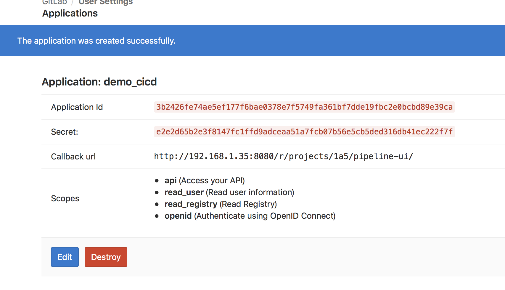

## pipeline登录

通过racnher ui 菜单中的流水线按钮可直接转到pipeline 管理界面，

## 授权认证设置

点击右上角的设置按钮进入设置界面

### GitHub认证

登录后默认选择GitHub，根据提示点击  点击此处 ，默认点击链接跳转到https://github.com/settings/developers ，如果企业使用私有的GitHub服务器，需要手动访问 https://github_server_url/settings/developers

这里我们以公有GitHub服务器为例：

#### 创建GitHub应用

登录GitHub服务器后，新建一个OAuth Apps

- Homepage URL、Authorization callback URL 都可以在pipeline界面查看到。

点击register application 完成应用创建，并自动跳转到应用详情界面。复制Client ID和Client Secret返回pipeline界面

#### 配置pipeline

返回pipeline，输入客户端ID和客户端秘钥，

如果是企业内部的私有GitHub服务器，这里需要勾选使用私有GitHub企业版部署，默认没有勾选；

如果GitHub服务配置了https访问，则需要勾选使用安全连接 (`https://`)，默认不勾选为http 协议。 

最后点击GitHub验证

验证时会弹出授权仓库，授权完成后返回

授权完成。

#### 授权多个GitHub账户

重复以上步骤可进行多个账户的授权。

### Gitlab认证

选择认证并点击点击此处 ，默认链接为https://gitlab.com/profile/applications，如果是私有部署的gitlab服务器需要手动访问 https://gitlab_server_url/profile/applications

这里我们以私有Gitlab服务器为例

#### 添加Gitlab应用

通过https://gitlab_server_url/profile/applications 访问私有Gitlab，填写相关参数：

Redirect URI地址通过pipeline页面查询, 最后点击sava application，并跳转到应用详情页，记录Application Id和Secret

#### 配置pipeline

返回pipeline界面，填写上一步获取到的Application Id和Secret（客户端ID和客户端秘钥）。因为是私有部署，所以需要勾选使用私有GitLab部署，并输入私有Gitlab服务器地址，取消https链接。

最后点击Gitlab验证，弹出授权仓库。

授权完成。

#### 授权多个Gitlab账号

重复以上步骤可进行多个账户的授权。