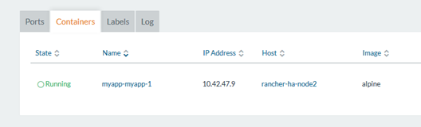
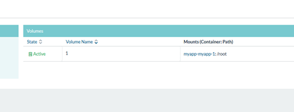
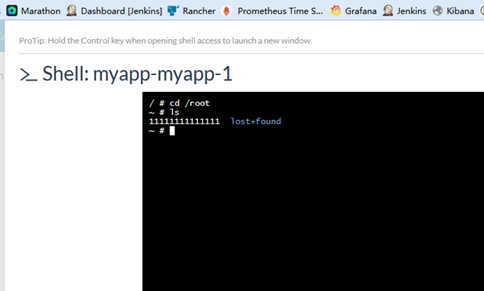

## 操作步骤

## Ceph 服务端安装

如果没有Ceph 服务器，可以通过容器运行一个Ceph 服务器 DEMO环境：

docker run -d –net=host -v /etc/ceph:/etc/ceph -e MON_IP=172.18.0.11 -e CEPH_PUBLIC_NETWORK=172.18.0.0/24 ceph/demo:tag-build-master-jewel-ubuntu-16.04

IP地址根据实际情况修改。

**把Ceph 服务容器所在宿主机/etc/ceph路径下所有文件复制到Rancher 环境下所有节点的相同路径下。**

## Rancher下Ceph应用安装

### 应用商店添加

进入 系统管理 |系统设置 添加一个名为Ceph的自定义商店

名称：Ceph

地址：https://github.com/niusmallnan/rancher-rbd-catalog.git

分支：master

### Ceph应用安装

进入应用商店，搜索RBD进行安装。安装完成后：

再进 系统架构|存储 查看：

## 安装测试应用

### 应用安装

新建一个名为myapp的空应用栈并添加服务：

红色线框为配置重点：

使用驱动卷插件与使用本地卷驱动有所区别， 使用本地卷驱动添加卷 时应该写 /AA/BB:/CC/DD,前后都要为路径； 使用驱动卷插件 时应该写为 A:/BB/CC 。 这个的A为一个卷名，不能是路径。

因为我们是Ceph存储，这里需要填卷驱动为：rancher-rbd 。部署好之后如图：

查看 基础架构|存储

### 数据存储测试

在容器中向/root 目录下新建一个文件：

现在这个容器位于node2上， 接着把这个服务容器删除，删除后myapp应用栈为空：

接着，在空的应用栈中添加一个服务，并手动调度容器运行到其他节点上。

PS：新建的服务，参数中的卷名与卷映射路径必须相同，卷驱动也要相同。

服务运行成功，运行在node1上

查看 基础架构|存储

进入容器的/root目录查看创建的文件

文件依然存在，说明文件不是存在本地，证明Ceph存储对接成功。