## 一、概述
前面的文章我们有讲述了如何通过Rancher-webhook实现Service/Host的弹性伸缩。本期，我们再来讲述一下通过Rancher-webhook对接三方的CI系统，如何实现微服务镜像的自动构建与服务的自动升级。

PS: CI即持续集成，包括但不限于自动编译、发布和测试、自动构建，我们这里说的CI系统仅限于自动构建这一步。
前面已经对webhook做了介绍，这里不再讲解. 

本文主要基于阿里云的容器镜像服务，整个流程大致如下图所示：

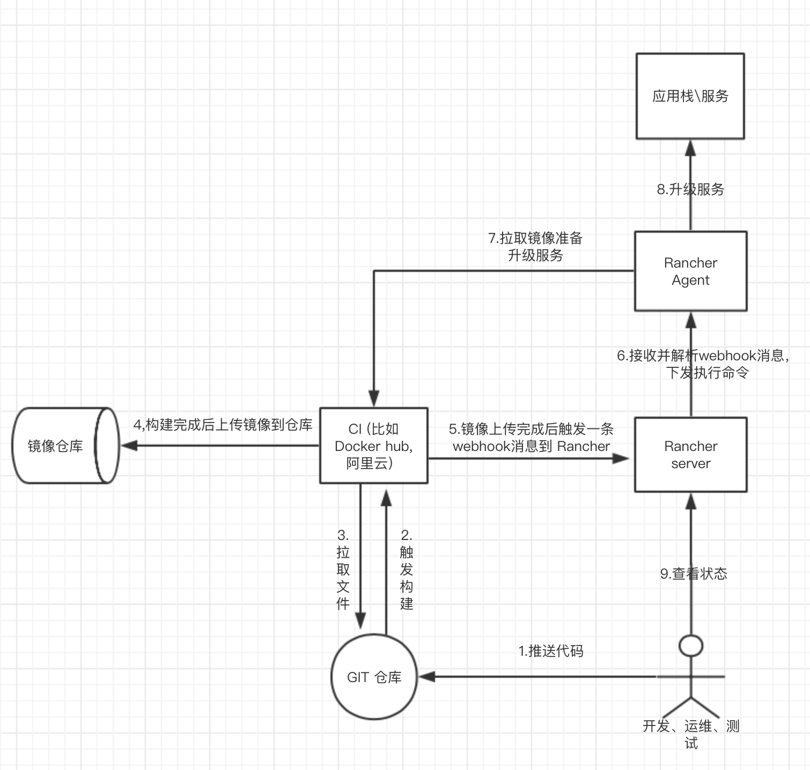

### 二、基础准备
1.	安装支持的docker (http://rancher.com/docs/rancher/v1.6/en/hosts/#supported-docker-versions);
2.	安装Rancher v1.6.11 (https://hub.docker.com/u/rancher);
3.	因为是对接云端CI，所以Rancher server 需要能被公网访问；
4.	在GitHub创建一个test仓库并上传一个 Dkoerfile 文件，文件中只写 FROM busybox 一行代码；
5.	去https://requestb.in/ 创建一个RequestBin，用于接收并查看阿里云webhook消息的内容；

### 三、测试服务准备
1.	登录 Rancher WEB ，进入 应用\用户视图，新建名为app的测试应用栈；
2.	给应用打上 test=true 的标签，其他参数保存默认；

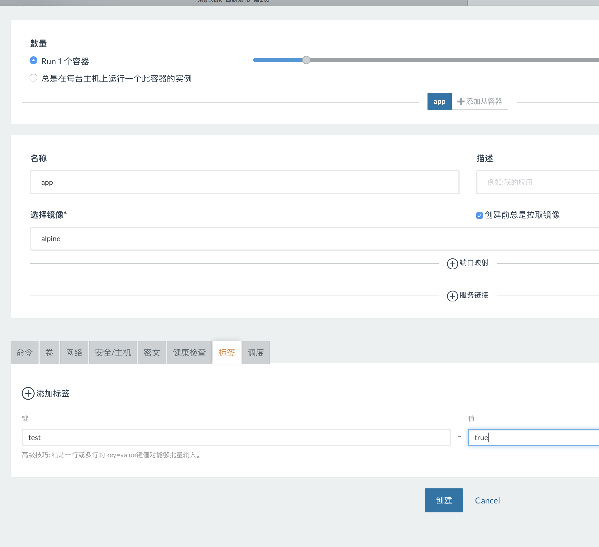
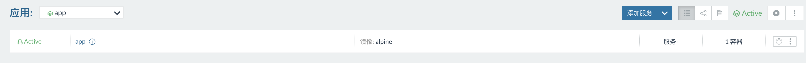

PS：这个地方的标签，是为后面通过webhook升级时候调取服务用，需要保证标签的唯一性，不然相同标签的服务都会被升级

测试服务已经创建好，接下来创建一条webhook升级策略。

### 四、添加webhook接收器
1.	通过API进入webhook：
2.	点击添加接收器，配置接收器：

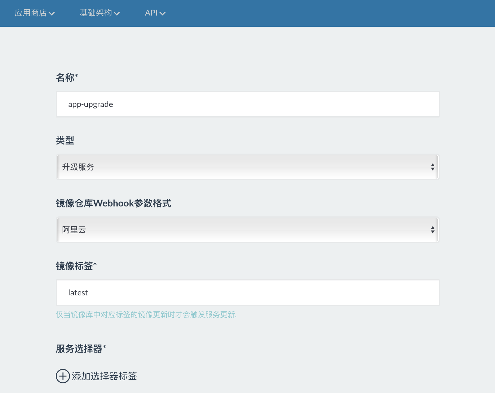
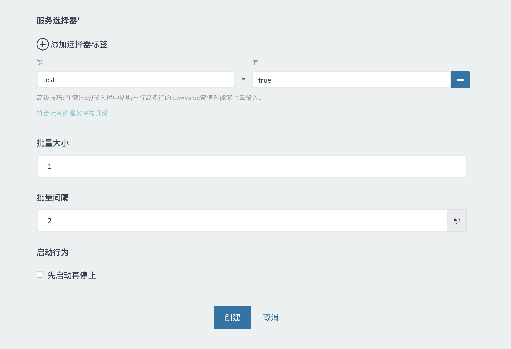

```
名称:根据喜好填写；
类型:选择升级服务；
镜像仓库Webhook参数格式；
镜像标签:这个标签对应仓库中构建镜像的标签
服务选择器标签:这里填写创建服务时填写的标签；
其他参数保持默认
```
接收器创创建好后，可以点击右侧的触发地址把地址复制到其他地方备用。

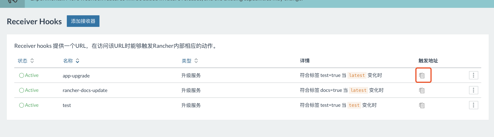

### 五、创建阿里云测试镜像仓库

通过dev.aliyun.com登录阿里云容器服务，进入控制台，点击右上角创建镜像仓库

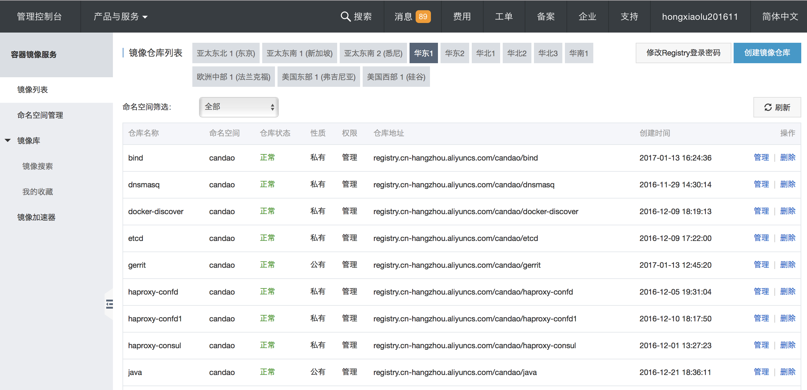
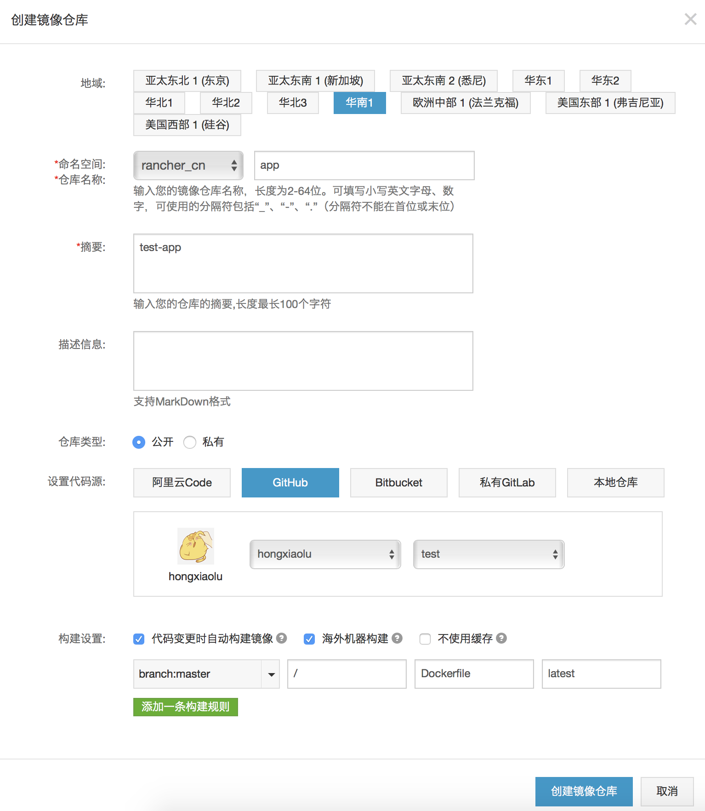

ps:选择与你服务器所在的区域，镜像可以走内网下载。

找到刚刚创建的仓库，点击管理

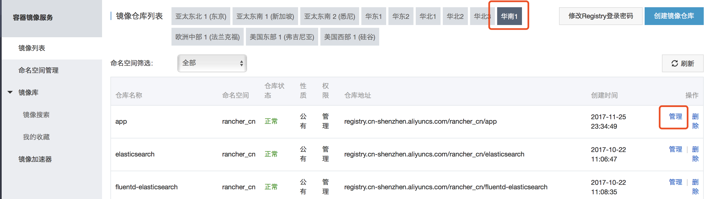

添加一条webhook，webhook URL为rancher-webhook中复制的地址。

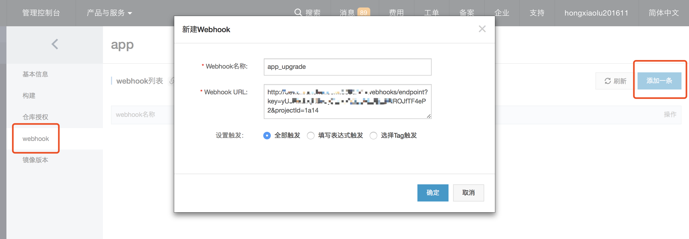


### 六、测试
修改并提交test代码仓库中的Dockerfile文件
在阿里云容器服务中查看构建进度

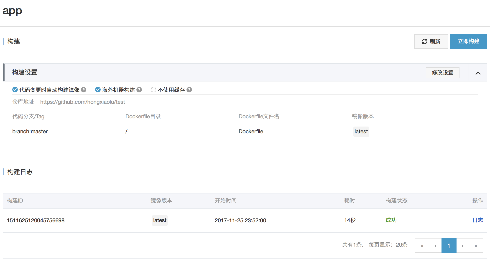
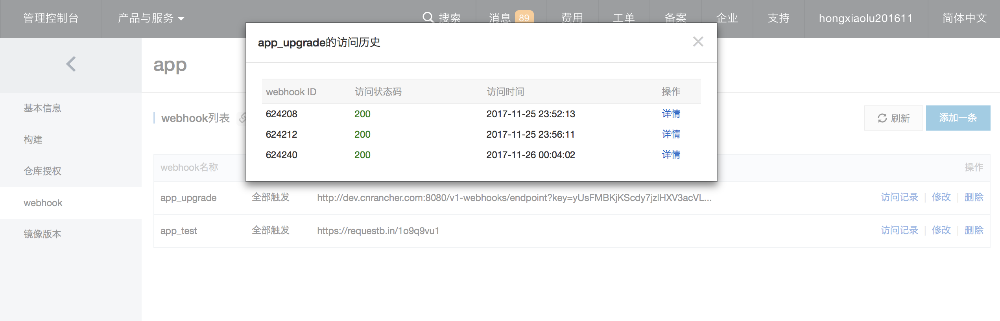
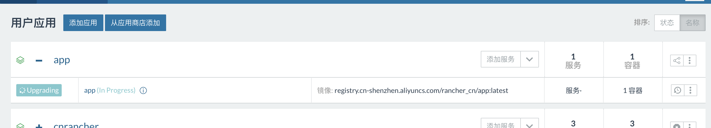
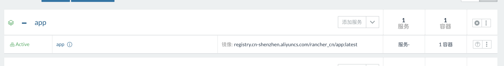

### 七、查看阿里云webhook的信息内容

复制 https://requestb.in/ 中创建的RequestBin地址

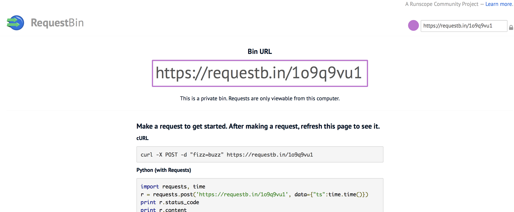

再在阿里云云服务中添加一条webhook

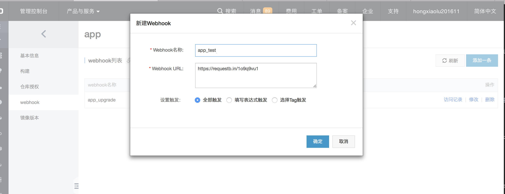

再次修改并提交test代码仓库中的Dockerfile文件，并进入https://requestb.in 页面查看：

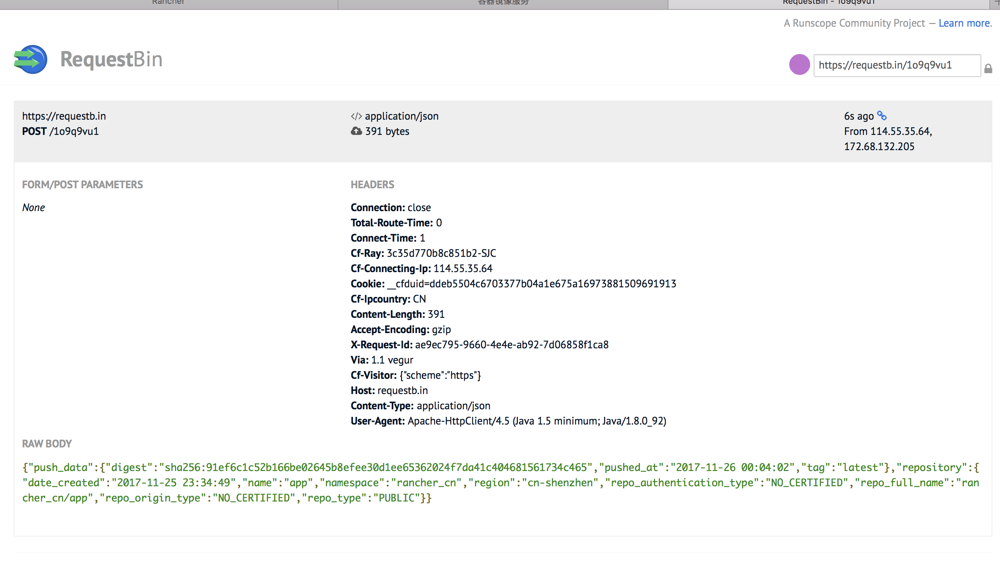

再对RAW BODY 格式化：

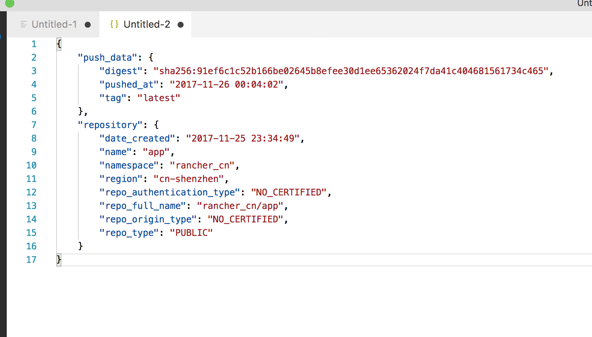

