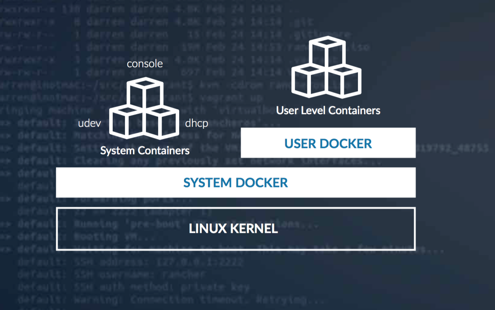

## RancherOS 概述

RancherOS是一个轻量级Linux分发版，操作系统完全由Docker容器组成。
RancherOS中的所有内容都是由Docker管理的容器，包括系统服务，如udev和syslog。RancherOS仅包含运行Docker所需的最少量的软件。	

## 一个由容器组成的操作系统

在RancherOS中，Docker守护进程是内核启动时运行的第一个程序。我们将这个Docker实例称为“System Docker”，因为它负责启动系统服务，如udev、DHCP和控制台。
每一个这种系统服务都是以容器形式运行的。System Docker代替了其他Linux分发版中的init系统，如sysvinit或systemd。

## 在独立的Docker守护进程中运行的User Docker

RancherOS创建了一个名为User Docker的特殊的系统服务容器，它是由System Docker创建的。User Docker容器中运行着一个独立的Docker守护进程。
因为所有的用户容器都在User Docker容器中运行，即使删除所有用户容器，都不会破坏运行着RancherOS服务的系统容器。

## 简单的更新与回滚

RancherOS利用极其强大的Docker包装和分装支持，来提供操作系统的更新和功能。一切系统服务都作为Docker容器被提供，而内核和初始RAM磁盘不是Docker容器，因此我们也用Docker包装和分装来提供内核和RAM磁盘的更新。

## 管理RancherOS

传统的Linux分发版通常被主要设计为由管理员手动操作。然而，RancherOS最开始设计的初衷就是要利用Docker API和主机复杂管理代理，让它们可以在大规模生产中通过Rancher这样的容器管理平台被轻松管理。
