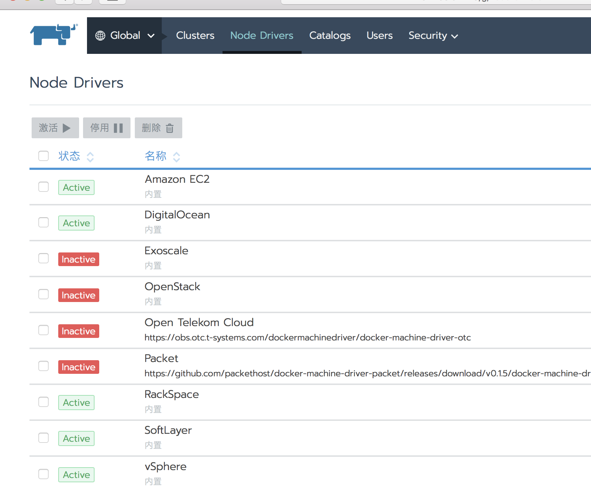
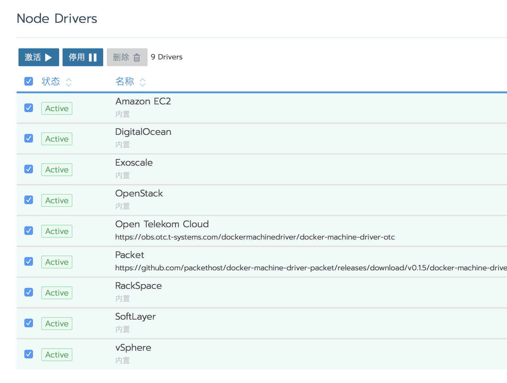
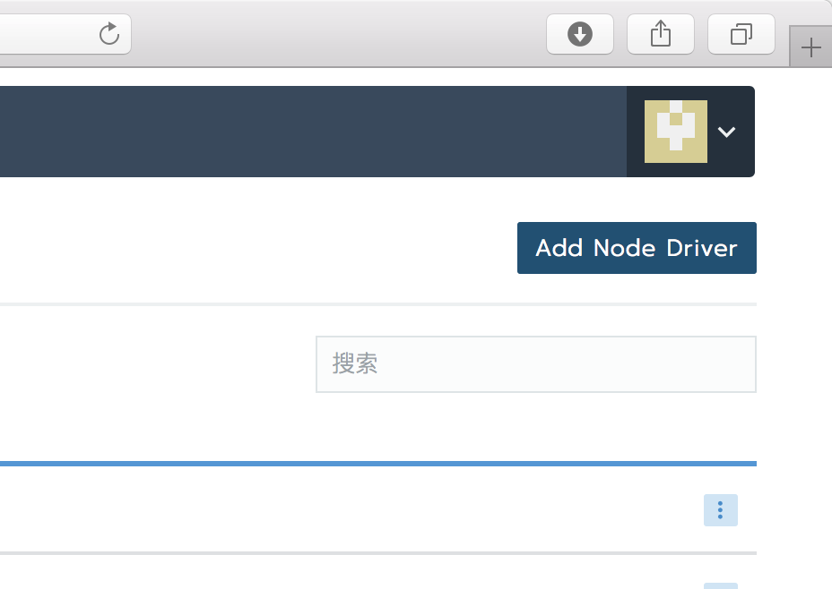
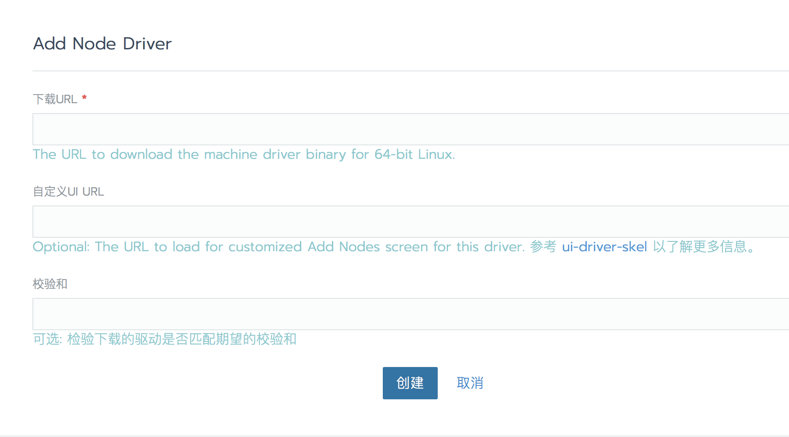

在第一次登录Rancher UI后，需要对系统做一些基础的配置。

##  主机驱动

### 激活驱动

切换到主机驱动页面，可以查看到目前已有的主机驱动，有的驱动未被激活，可以根据需要激活相应的驱动。

### 添加主机驱动

添加主机驱动功能，可以把自己开发的驱动添加到平台中使用。

下载URL: Rancher server通过这个地址去下载驱动文件（必填）;
自定义UI URL: 自定义主机驱动界面的缩略图（可选）;
经验和: 检验下载的驱动是否匹配期望的校验和（可选）;

##  应用商店

与1.6版本一样，2.0 也支持应用商店。
目前有Stable和Incubator两个商店：
Helm-Stable：https://github.com/ibuildthecloud/rancher-charts
helm-incubator：https://kubernetes-charts-incubator.storage.googleapis.com/

### 添加应用商店

如果搭建了私有的Helm仓库，可以通过添加应用商店的方式加入Rancher。

### 