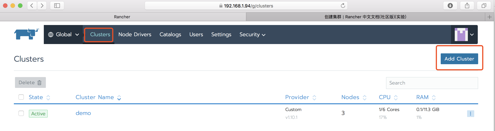

> 安装注意：
>
> 如果你当前节点曾经安装过Rancher 2.0,那需要进行初始化：
>
> docker rm -fv $(docker ps -aq) 
>
> docker volume rm  $(docker volume ls) 
>
> rm -rf /etc/kubernetes/
>
> rm -rf /var/lib/rancher/
>
> rm -rf /var/lib/etcd/

## 添加集群

1. 登录rancher ui ,点击菜单中clusters，再点击Add Cluster

2. 选择集群添加方式，比如custom；
3. 设置集群名Cluster Name(必填)；
4. 成员角色(可选)：根据实际需求添加。 添加成员角色前需要在用户中增加成员和对应的角色；admin 用于所有集群的管理权限，
5. 集群选项：
   * 选择Kubernetes Version: 选择要部署的K8S版本；
   * 网络插件：选择一种网络超级；
   * Pod Security Policy Support：是否开启Pod Security Policy Support，如要开启，需提前在POD安全策略中添加策略；
   * ​