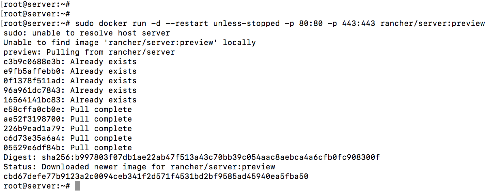
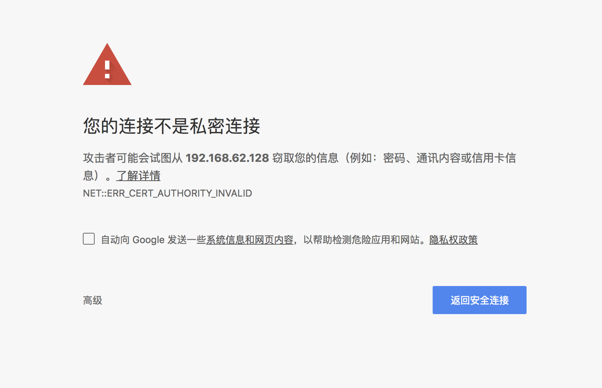
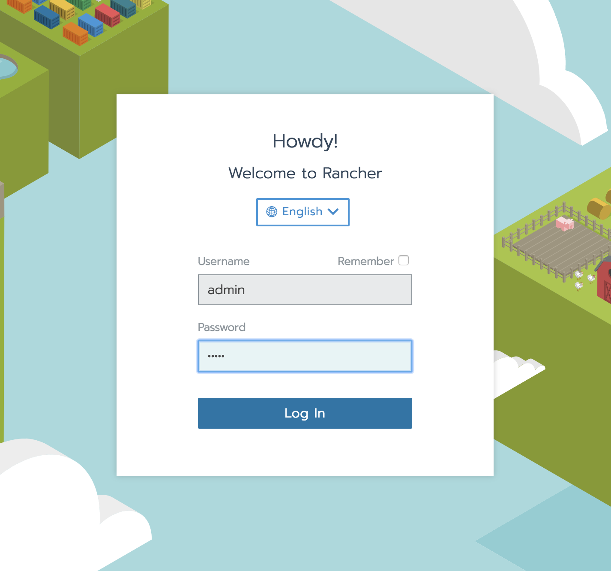
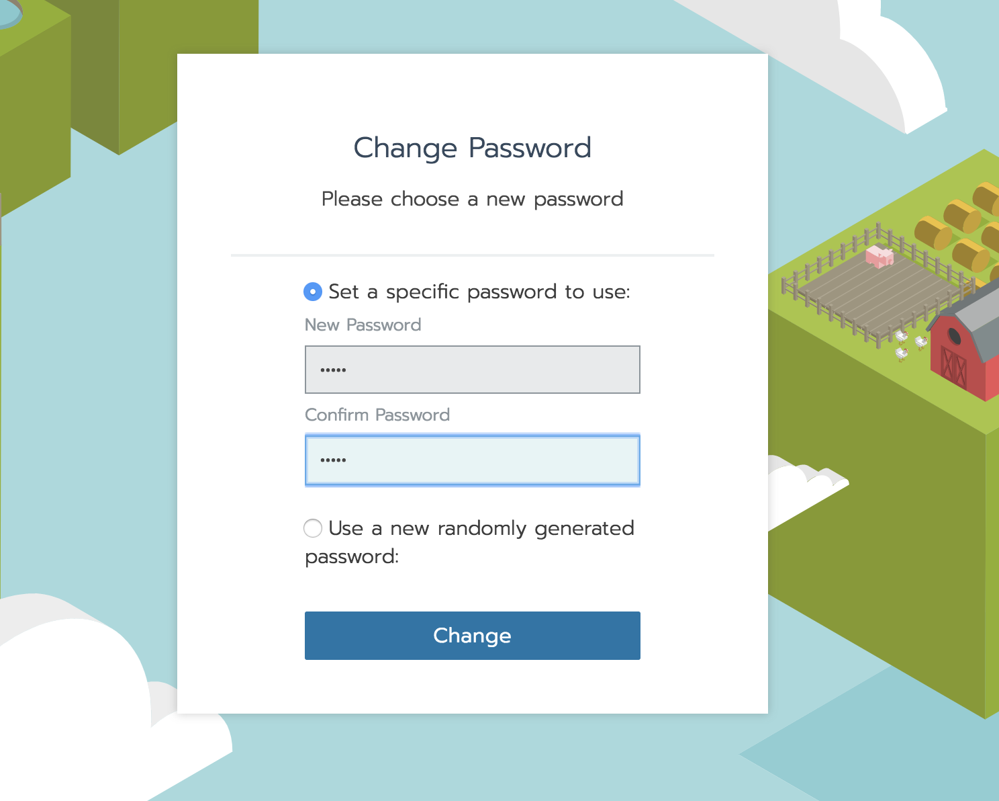
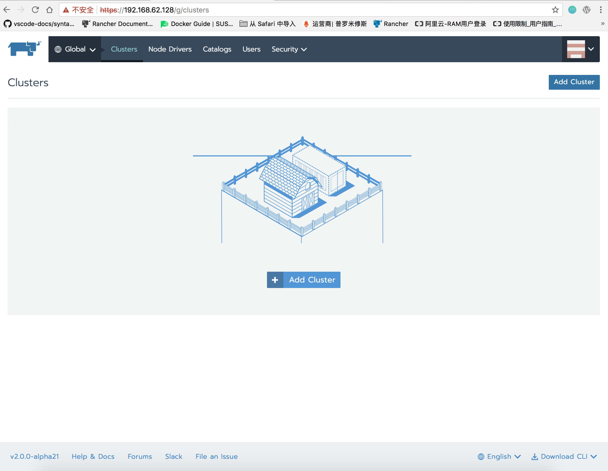

### 准备Linux主机
1.  准备一个64位Ubuntu 16.04的Linux主机，至少4GB的内存。

2.  在主机上安装支持的Docker，支持的Docker版本目前有：1.12.6，1.13.1或17.03.2。

  >	要在服务器上安装Docker，请按照Docker的安装说明进行操作。

### 启动Rancher server

只需要一条命令，不到一分钟即可安装并启动Rancher服务器。安装完成后，您可以打开Web浏览器访问Rancher UI。

1. 在你的主机上运行以下Docker命令：

```
sudo docker run -d --restart unless-stopped -p 80:80 -p 443:443 rancher/server:preview
```



2. 通过https://<SERVER_IP> 去访问Rancher UI，<SERVER_IP>为主机可外部访问的IP地址。Rancher会自动使用默认管理员进行身份验证。您将需要使用此用户（admin）和密码（admin）登录。首次登录时，系统会要求您更改默认管理员的密码。

>	Rancher仅支持HTTPS，并且默认配置为使用自签名证书。GA之前将提供替换此证书的功能。因此，在继续之前，浏览器会提示您信任此证书。




###  登录Rancher UI

默认登录账号和密码为（admin/admin）,第一次登录要求更改密码





